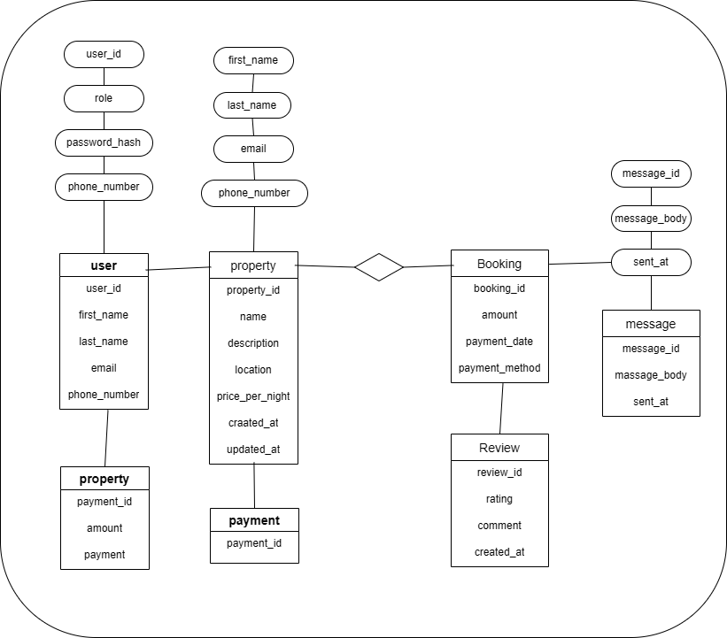

# Entity-Relationship (ER) Diagram - AirBnB Database

## Overview
This document describes the ER diagram representing the database structure for the AirBnB system. It defines the main entities, their attributes, and the relationships among them.

## Entities and Attributes
(Include the six entities and their attributes as listed above.)

## Relationships
- User to Property → One-to-Many
- User to Booking → One-to-Many
- Property to Booking → One-to-Many
- Booking to Payment → One-to-Many
- User to Review → One-to-Many
- Property to Review → One-to-Many
- User to Message (sender/recipient) → One-to-Many

## Diagram

*Note: The ER diagram image (airbnb_erd.png) should be exported from Draw.io or Lucidchart and placed in this same directory.*

## 🧩 Step 1: Identifying Entities and Attributes
### 1. User

- **Primary Key:** user_id

- **Attributes:**

    - first_name

    - last_name

    - email

    - password_hash

    - phone_number

    - role (guest, host, admin)

    - created_at

### 2. Property

- **Primary Key:** property_id

- **Foreign Key:** host_id → User(user_id)

- **Attributes:**

    - name

    - description

    - location

    - pricepernight

    - created_at

    - updated_at

### 3. Booking

- **Primary Key:** booking_id

- **Foreign Keys:**

    - property_id → Property(property_id)

    - user_id → User(user_id)

- **Attributes:**

    - start_date

    - end_date

    - total_price

    - status (pending, confirmed, canceled)

    - created_at

### 4. Payment

- **Primary Key:** payment_id

- **Foreign Key:** booking_id → Booking(booking_id)

- **Attributes:**

    - amount

    - payment_date

    - payment_method (credit_card, paypal, stripe)

### 5. Review

- **Primary Key:** review_id

- **Foreign Keys:**

    - property_id → Property(property_id)

    - user_id → User(user_id)

- **Attributes:**

    - rating (1–5)

    - comment

    - created_at

### 6. Message

- **Primary Key:** message_id

- **Foreign Keys:**

    - sender_id → User(user_id)

    - recipient_id → User(user_id)

- **Attributes:**

    - message_body

    - sent_at

---

## 🔗 Step 2: Defining The Relationships Between Entities

| Relationship                   | Description                                | Cardinality |
| ------------------------------ | ------------------------------------------ | ----------- |
| **User → Property**            | A user (host) can own multiple properties. | 1-to-many   |
| **User → Booking**             | A user (guest) can make multiple bookings. | 1-to-many   |
| **Property → Booking**         | A property can have many bookings.         | 1-to-many   |
| **Booking → Payment**          | Each booking has one or more payments.     | 1-to-many   |
| **User → Review**              | A user can write many reviews.             | 1-to-many   |
| **Property → Review**          | A property can have many reviews.          | 1-to-many   |
| **User (sender) → Message**    | A user can send many messages.             | 1-to-many   |
| **User (recipient) → Message** | A user can receive many messages.          | 1-to-many   |

---

## 🧠 Step 3: Diagram Structure Overview

When drawing your ER diagram (using draw.io, Lucidchart, or ERDPlus), represent the following visually:

- **Entities** as rectangles (User, Property, Booking, Payment, Review, Message)

- **Attributes** as ovals connected to their entities

- **Primary keys** underlined

- **Relationships** as diamonds with labeled lines between entities

---

