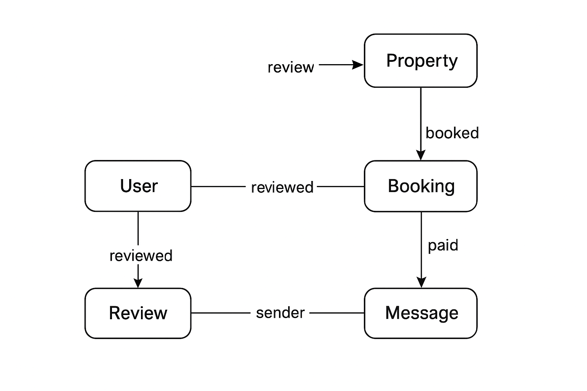

# AirBnB Database Sample Data

## Overview
This script populates the AirBnB database with **sample data** representing real-world usage.  
It includes multiple users (hosts and guests), properties, bookings, payments, reviews, and messages — all consistent with the database schema defined earlier.

---

## Database Relationship Overview

The following diagram illustrates how entities are connected in the AirBnB database:



---

## Entities Populated
| Entity | Description | Example Records |
|---------|--------------|----------------|
| **User** | Hosts and guests who use the platform | Alice (Host), Bob (Guest), Clara (Guest), David (Host) |
| **Property** | Listings created by hosts | Seaside Villa (Lagos), Urban Apartment (Abuja) |
| **Booking** | Reservations made by guests for properties | Bob booked Seaside Villa, Clara booked Urban Apartment |
| **Payment** | Payments linked to bookings | Bob paid via credit card, Clara via PayPal |
| **Review** | Feedback left by guests after booking | Bob rated Seaside Villa 5 stars |
| **Message** | Communication between users | Bob ↔ Alice, Clara ↔ David |

---

## Relationships Demonstrated
| Relationship | Example |
|---------------|----------|
| **User → Property** | Alice (User u1) owns Seaside Villa (Property p1) |
| **User → Booking** | Bob (User u2) booked Seaside Villa (Property p1) |
| **Booking → Payment** | Booking b1 has Payment pay1 |
| **User → Review** | Bob (User u2) reviewed Seaside Villa (Property p1) |
| **User → Message** | Bob messaged Alice about availability |

---

## How to Run
Run the SQL file after creating the schema:

### PostgreSQL
```bash
psql -U your_username -d airbnb_db -f seed.sql

### MySQL

mysql -u your_username -p airbnb_db < seed.sql

---

### Example Query Results

After running the script, you can verify data insertion using queries like:

SELECT * FROM User;
SELECT * FROM Property;
SELECT * FROM Booking WHERE status = 'confirmed';
SELECT * FROM Payment WHERE payment_method = 'stripe';
SELECT * FROM Review ORDER BY rating DESC;
SELECT * FROM Message LIMIT 10;

These queries confirm that the seed data is properly linked and consistent with your ER diagram.

### Notes

- All UUIDs are simplified for clarity (e.g., 'u1', 'p1', etc.) — replace them with true UUIDs in production.

- Timestamps use the current system time (CURRENT_TIMESTAMP).

- Values such as price, rating, and comments are realistic to simulate real usage scenarios.

---

### License

This script is part of the ALX AirBnB Database Project, designed for educational and demonstration purposes.